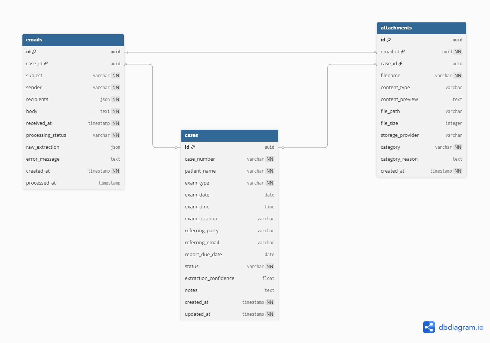

# Triage - IME Email Processing System

Full-stack application that processes inbound emails for Independent Medical Examination (IME) companies, extracting structured case data using LLM and providing an intuitive web interface for case management.

## Architecture Overview


## Tech Stack

- **Backend**: FastAPI (Python 3.11+)
- **Database**: PostgreSQL 15 + SQLAlchemy + Alembic
- **LLM**: OpenAI GPT-4o for structured data extraction
- **Email Integration**: IMAP (Gmail, Outlook) with background polling
- **Frontend**: React 18 + TypeScript + Vite
- **Styling**: TailwindCSS
- **State Management**: React Query (@tanstack/react-query)
- **Testing**: Pytest

## Quick Start

### 1. Prerequisites

- Python 3.11+
- Docker & Docker Compose
- OpenAI API key

### 2. Environment Setup

```bash
# Clone or navigate to the project
cd Triage

# Copy environment template
cd backend
cp .env.example .env

# Edit .env and add your credentials
# OPENAI_API_KEY=sk-...

# Optional: Enable real email integration
# EMAIL_ENABLED=true
# EMAIL_ADDRESS=your-email@gmail.com
# EMAIL_PASSWORD=your-app-password
```

**For Email Integration (Optional):** See [EMAIL_INTEGRATION.md](EMAIL_INTEGRATION.md) for detailed setup instructions.

### 3. Start PostgreSQL

```bash
# Start PostgreSQL container
docker compose up -d

# Verify it's running
docker compose ps
```

### 4. Install Python Dependencies

```bash
cd backend

# Create virtual environment
python -m venv venv

# Activate virtual environment
# On Windows:
venv\Scripts\activate
# On macOS/Linux:
source venv/bin/activate

# Install dependencies
pip install -r requirements.txt
```

### 5. Run Database Migrations

```bash
# Apply database schema
alembic upgrade head
```

### 6. Start the API Server

```bash
# Run the FastAPI application
uvicorn app.main:app --reload --port 8000
```

The API will be available at:
- **API**: http://localhost:8000
- **Interactive Docs**: http://localhost:8000/docs
- **Alternative Docs**: http://localhost:8000/redoc

### 7. Start the Frontend (Optional)

```bash
cd frontend

# Install dependencies
npm install

# Start development server
npm run dev
```

The frontend will be available at:
- **UI**: http://localhost:5173
- API requests are proxied to backend automatically

## Usage

### Process Sample Emails

The project includes **10 sample email files** in `backend/sample_emails/`:

**Clean & Professional:**
1. **email_001.json** - Orthopedic referral (Johnathan Doe, NF-39281)
2. **email_002.json** - Scheduling confirmation (Jane Smith, 2024-7781)
3. **email_004.json** - Psychiatric evaluation (Sarah Martinez, WC-2025-4432)
4. **email_009.json** - Cardiology IME (Angela Chen, CV-2025-9943)

**Follow-ups & Updates:**
5. **email_005.json** - Additional documents for existing case (NF-39281)
6. **email_008.json** - Schedule change with conflicts (2024-7781)

**Messy & Edge Cases:**
7. **email_003.json** - Informal intake (Robert L. Hernandez, RH-99102)
8. **email_006.json** - Very messy, uncertain data (Michael Thompson)
9. **email_007.json** - Urgent with missing info (David Kim, WC-2025-1156)
10. **email_010.json** - Extreme outlier, forwarded mess (Patricia Rodriguez)

**Process all samples:**
```bash
curl -X POST http://localhost:8000/emails/simulate-batch
```

Or via the interactive docs at http://localhost:8000/docs, or using the frontend at http://localhost:5173/process

### Process Real Emails (Optional)

**Enable email integration** to automatically process real emails from Gmail/Outlook:

```bash
# Set in .env
EMAIL_ENABLED=true
EMAIL_ADDRESS=your-email@gmail.com
EMAIL_PASSWORD=your-app-password

# Restart server - emails auto-process every 60 seconds
uvicorn app.main:app --reload
```

**Or trigger manually:**
```bash
curl -X POST http://localhost:8000/email-polling/manual-poll
```

See [EMAIL_INTEGRATION.md](EMAIL_INTEGRATION.md) for setup guide.

### Ingest Individual Email

```bash
curl -X POST http://localhost:8000/emails/ingest \
  -H "Content-Type: application/json" \
  -d '{
    "subject": "New IME Referral",
    "sender": "referrals@lawfirm.com",
    "recipients": ["intake@ime.com"],
    "body": "Case details...",
    "attachments": []
  }'
```

Note: `received_at` is optional and defaults to current time if not provided.

### List Cases

```bash
# All cases
curl http://localhost:8000/cases/

# Filter by confidence threshold
curl http://localhost:8000/cases/?min_confidence=0.8

# Filter by status
curl http://localhost:8000/cases/?status=pending
```

### Get Case Details

```bash
# By ID
curl http://localhost:8000/cases/{case_id}

# By case number
curl http://localhost:8000/cases/by-number/NF-39281
```

### Update Case

```bash
curl -X PATCH http://localhost:8000/cases/{case_id} \
  -H "Content-Type: application/json" \
  -d '{
    "status": "confirmed",
    "notes": "Patient confirmed attendance"
  }'
```

### Query Attachments

```bash
# List all attachments
curl http://localhost:8000/attachments/

# Filter by category
curl http://localhost:8000/attachments/?category=medical_records

# Get attachments for specific case
curl http://localhost:8000/attachments/case/{case_id}/attachments

# Get medical records only
curl http://localhost:8000/attachments/by-category/medical_records
```

## API Endpoints

### Emails

- `POST /emails/ingest` - Submit an email for processing
- `POST /emails/simulate-batch` - Process all sample emails
- `GET /emails/{id}` - Get email details with extraction
- `GET /emails/` - List all emails (with filters)

### Cases

- `GET /cases/` - List cases (filterable by status, exam_type, confidence)
- `GET /cases/{id}` - Full case details with emails and attachments
- `GET /cases/by-number/{case_number}` - Get case by case number
- `PATCH /cases/{id}` - Update case fields

### Attachments

- `GET /attachments/` - List attachments (filterable by category, case_id)
- `GET /attachments/{id}` - Get specific attachment details
- `GET /attachments/by-category/{category}` - Filter by category (medical_records, declaration, cover_letter, other)
- `GET /attachments/case/{case_id}/attachments` - Get all attachments for a specific case

### Email Polling

- `POST /email-polling/manual-poll` - Manually trigger email fetching and processing
- `GET /email-polling/status` - Get current email configuration status

## Running Tests

```bash
cd backend

# Run all tests
pytest

# Run with coverage
pytest --cov=app tests/

# Run specific test file
pytest tests/test_api.py -v
```

## Project Structure

```
triage/
├── backend/
│   ├── app/
│   │   ├── main.py              # FastAPI app entry point
│   │   ├── config.py            # Settings configuration
│   │   ├── database.py          # Database setup
│   │   ├── models/              # SQLAlchemy ORM models
│   │   │   ├── case.py
│   │   │   ├── email.py
│   │   │   └── attachment.py
│   │   ├── schemas/             # Pydantic schemas
│   │   │   ├── case.py
│   │   │   ├── email.py
│   │   │   └── extraction.py    # LLM extraction schema
│   │   ├── services/            # Business logic
│   │   │   ├── extraction.py    # OpenAI integration
│   │   │   ├── ingestion.py     # Email processing pipeline
│   │   │   ├── email_fetcher.py # IMAP email fetching
│   │   │   ├── email_parser.py  # Email format adapter
│   │   │   └── email_poller.py  # Background email polling
│   │   └── routers/             # API endpoints
│   │       ├── cases.py
│   │       ├── emails.py
│   │       ├── attachments.py
│   │       └── email_polling.py
│   ├── sample_emails/           # Sample email JSON files
│   ├── tests/                   # Test suite
│   ├── alembic/                 # Database migrations
│   ├── requirements.txt
│   └── pytest.ini
├── frontend/
│   ├── src/
│   │   ├── components/          # Reusable UI components
│   │   │   ├── Layout.tsx
│   │   │   ├── CaseCard.tsx
│   │   │   ├── ConfidenceBadge.tsx
│   │   │   ├── StatusBadge.tsx
│   │   │   ├── CategoryBadge.tsx
│   │   │   ├── AttachmentPreviewModal.tsx
│   │   │   └── EmailPreviewModal.tsx
│   │   ├── pages/               # Page components
│   │   │   ├── Dashboard.tsx
│   │   │   ├── CaseDetail.tsx
│   │   │   └── ProcessEmails.tsx
│   │   ├── hooks/               # React Query hooks
│   │   │   ├── useCases.ts
│   │   │   └── useEmails.ts
│   │   ├── api/                 # API client
│   │   │   └── client.ts
│   │   ├── utils/               # Utility functions
│   │   │   └── dateUtils.ts     # Timezone-safe date formatting
│   │   ├── types/               # TypeScript types
│   │   │   └── index.ts
│   │   ├── App.tsx
│   │   └── main.tsx
│   ├── package.json
│   ├── vite.config.ts
│   └── tailwind.config.js
├── docker-compose.yml
├── .env.example
├── EMAIL_INTEGRATION.md      # Email integration setup guide
└── README.md
```

## Data Models

### Case
Primary entity representing an IME case:
- `case_number`: Unique identifier (e.g., "NF-39281")
- `patient_name`: Claimant's full name
- `exam_type`: Type of examination (Orthopedic, Neurology, etc.)
- `exam_date`, `exam_time`: Scheduled examination
- `exam_location`: City/state or address
- `referring_party`: Law firm or organization
- `status`: pending | confirmed | completed
- `extraction_confidence`: 0.0-1.0 LLM confidence score

### Email
Source records that link to cases:
- Stores raw email data (subject, sender, body, recipients)
- `raw_extraction`: JSON blob of LLM response
- `processing_status`: pending | processing | processed | failed

### Attachment
Email attachments with categorization and storage:
- Links to both email (source) and case (for efficient querying)
- `category`: medical_records | declaration | cover_letter | other
- `content_preview`: First 500 characters (viewable in frontend modal)
- **Storage fields** (for S3/cloud integration):
  - `file_path`: Cloud storage path (e.g., "s3://bucket/cases/NF-39281/file.pdf")
  - `file_size`: File size in bytes
  - `storage_provider`: Storage backend (s3, azure, local, etc.)

## Frontend Features

### Dashboard
- **Case Grid View**: Cards showing key information
- **Search**: Filter cases by patient name or case number
- **Status Filter**: Filter by pending/confirmed/completed
- **Confidence Filter**: Show only high-confidence cases (≥0.8)
- **Stats Overview**: Total cases, pending, high confidence count

### Case Detail Page
- **Full Case Information**: All extracted fields
- **Edit Mode**: Update status (pending → confirmed → completed) and notes
- **Related Emails Section**: View all emails linked to the case
- **Attachments Section**: Browse and preview attachments
- **Email Preview Modal**: Click any email to view full content, metadata, and processing status
- **Attachment Preview Modal**: Click any attachment to view content preview (first 500 chars)
- **Confidence Badge**: Color-coded (green ≥0.8, yellow ≥0.5, red <0.5)
- **Timestamps**: Created and updated dates

### Process Emails Page
- **Batch Processing**: Process all sample emails with one click
- **Results Display**: Shows processed count, failed count, and individual email results
- **Error Details**: View specific errors for failed emails

### UI Components
- **Color-Coded Badges**: Visual indicators for status, confidence, and categories
- **Responsive Design**: Works on desktop and mobile
- **Professional Theme**: Blue/gray color scheme
- **Sidebar Navigation**: Easy access to all pages

## LLM Extraction

The system uses OpenAI's GPT-4o with structured output (function calling) to extract:

**Required Fields:**
- patient_name, case_number, exam_type, attachments

**Optional Fields:**
- exam_date, exam_time, exam_location, referring_party, report_due_date

**Metadata:**
- confidence (0-1): Quality assessment
- extraction_notes: Ambiguities or uncertainties
- email_intent: new_referral | scheduling_update | document_submission | inquiry | other

### Confidence Thresholds

- `≥ 0.8`: High confidence - auto-process
- `0.5 - 0.8`: Medium confidence - flag for review
- `< 0.5`: Low confidence - requires manual review

### Intelligent Case Updates

When processing multiple emails for the same case:

**Option 3: High Confidence Auto-Update**
- If new extraction has **higher confidence** than existing case → automatically update ALL fields
- Logs: `"AUTO-UPDATED: Higher confidence extraction (0.95 > 0.85)"`

**Option 4: Low Confidence Manual Review**
- If new extraction has **lower/equal confidence** → only fill empty fields
- Detects conflicts and flags in notes: `"⚠️ MANUAL REVIEW NEEDED (Low confidence: 0.75)"`
- Lists all conflicts: `"Exam Date: 2025-03-18 -> 2025-03-22"`

### Missing Critical Fields Validation

Automatically flags cases missing critical information:

**Critical Fields:**
- Exam Date
- Exam Location
- Report Due Date
- Exam Time (semi-critical)

**Auto-Generated Note:**
```
🔔 FOLLOW-UP REQUIRED
Missing critical information:
  - Exam Date
  - Report Due Date

Action needed: Contact referring party to obtain missing details.
```

## Database Design & Optimization
### Schema


### Normalization
The database follows **3rd Normal Form (3NF)** with strategic denormalization for performance:

**Normalized Design:**
- Each table has a single primary key (UUID)
- No repeating groups
- No transitive dependencies

**Strategic Denormalization:**
- **Attachments link to both email and case**: Enables fast queries without JOINs
- **Confidence stored in cases table**: Allows filtering without parsing JSON
- **Indexes on frequently queried columns**: Optimizes query performance

### Performance Indexes

**Cases Table:**
- `case_number` (unique) - For case matching
- `status` - For filtering by case status
- `extraction_confidence` - For confidence-based queries
- `created_at` - For sorting by date
- `exam_date` - For scheduling queries

**Emails Table:**
- `case_id` - For JOIN operations
- `processing_status` - For status filtering
- `received_at` - For date sorting

**Attachments Table:**
- `email_id` - For JOIN operations
- `case_id` - For case queries (enables direct lookup)
- `category` - For category filtering

### Query Performance
With indexes, queries scale from **O(n)** to **O(log n)**:
- Small datasets (< 100 rows): Seq scan is faster
- Large datasets (1000+ rows): Index scan is 10-100x faster

## Database Management

### Create New Migration

```bash
cd backend
alembic revision --autogenerate -m "description of changes"
```

### Apply Migrations

```bash
cd backend
alembic upgrade head
```

### Rollback Migration

```bash
cd backend
alembic downgrade -1
```

### Clear Database (Keep Schema)

```bash
# Quick truncate (keeps tables)
docker compose exec postgres psql -U postgres -d triage -c "TRUNCATE cases, emails, attachments CASCADE;"
```

### Reset Database (Clean Slate)

```bash
# Drop and recreate database
docker compose exec postgres psql -U postgres -c "DROP DATABASE triage;"
docker compose exec postgres psql -U postgres -c "CREATE DATABASE triage;"

# Reapply migrations
cd backend
alembic upgrade head
```

## Development

### Code Quality

```bash
# Format code (if using black)
black app/

# Lint (if using ruff)
ruff check app/
```

### View API Logs

```bash
# API logs show SQL queries in development mode
# Check terminal where uvicorn is running
```

### Access Database

```bash
# Connect to PostgreSQL
docker compose exec postgres psql -U postgres -d triage

# Example queries
\dt                    # List tables
SELECT * FROM cases;   # View cases
SELECT * FROM emails;  # View emails
```

## Troubleshooting

### Database Connection Issues

```bash
# Check if PostgreSQL is running
docker compose ps

# View logs
docker compose logs postgres

# Restart database
docker compose restart postgres
```

### OpenAI API Errors

- Verify `OPENAI_API_KEY` is set correctly in `.env`
- Check API key has sufficient credits
- Review error messages in email `error_message` field

### Email Integration Issues

**Email polling not starting:**
- Check `EMAIL_ENABLED=true` in `.env`
- Verify all email credentials are configured
- Check logs for startup messages

**Authentication failed:**
- Ensure 2FA is enabled on Gmail
- Regenerate app password (no spaces)
- Verify `EMAIL_PASSWORD` is correct in `.env`

**No emails found:**
- Check if you have unread emails in inbox
- Verify `EMAIL_ADDRESS` is correct
- Test manual poll: `curl -X POST http://localhost:8000/email-polling/manual-poll`

**For detailed setup instructions, see [EMAIL_INTEGRATION.md](EMAIL_INTEGRATION.md)**

### Migration Issues

```bash
# Check current version
alembic current

# View migration history
alembic history
```

